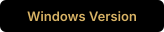

# ShotLab

<p align="center">
  
</p>

<p align="center">
  A local visual-reference library for building your own visual memory.
</p>

<p align="center">
  
</p>

<p align="center">
  <a href="#english">English</a> · <a href="#فارسی">فارسی</a>
</p>

<a id="english"></a>

## 🎬 About ShotLab

ShotLab is a tool I originally built for myself through vibe coding with
ChatGPT. I am sharing it freely so filmmakers, cinematographers, lighting
artists, colorists, animators, and visual storytellers can build their own
visual memory.

Instead of automatically describing or interpreting images with AI, ShotLab
keeps the creative decisions in your hands. It extracts an objective color
palette from each frame, while titles, shot information, mood, tags, and notes
remain fully editable by you.

ShotLab works locally. Your source videos remain on your computer and are never
copied into the database or included in a library export.

## ✨ Features

- Create independent visual libraries for films, projects, or research topics.
- Load and play local videos with a frame-accurate timeline.
- Capture the exact frame currently displayed in the player.
- Move forward or backward one frame at a time.
- Import still images manually in addition to capturing video frames.
- Extract a five-color palette with real image-coverage percentages.
- Copy HEX values directly from palette colors.
- Add and edit shot size, camera angle, location, lens type, time of day,
  lighting style, key quality, mood, tags, title, and notes.
- Search across all manually entered information.
- Filter frames by category, HEX code, or perceptually similar colors.
- Browse selected frames in a dedicated Gallery Workspace.
- Resize thumbnails independently in Capture and Gallery workspaces.
- Add non-destructive annotations with freehand pen, line, arrow, rectangle,
  ellipse, text, color, stroke-width, undo, and redo tools.
- Display saved annotations automatically on thumbnails throughout the app.
- Reopen, edit, replace, or completely remove annotations without modifying
  the original stored frame.
- Store captured frames in small, medium, or original resolution.
- Download either the original frame or the version with annotations.
- Export and restore complete ShotLab libraries without the source video.
- Export frame collections as one-, two-, or three-column PDF reference sheets,
  using either original frames or versions with annotations.
- Use English or Persian with bundled Inter and Vazirmatn fonts.
- Switch between dark and light themes.
- Work entirely offline after the initial development setup.

## 🧩 Technical Overview

ShotLab is a Windows desktop application built with:

| Component | Technology |
| --- | --- |
| Language | Python 3.11+ |
| Desktop UI | PySide6 / Qt 6 |
| Database | SQLite |
| Image processing | Pillow |
| Video metadata and frame extraction | FFmpeg / FFprobe |
| PDF export | Qt PDF painting |
| Windows packaging | PyInstaller |
| Installer | Inno Setup 7 |
| Interface languages | English and Persian |
| Bundled fonts | Inter and Vazirmatn |

The application is divided into focused modules:

- `repository.py` manages SQLite records, manifests, captures, and project
  folders.
- `session.py` manages the active source video and capture drafts.
- `media.py` handles FFmpeg, FFprobe, fingerprints, timecodes, and extraction.
- `analysis.py` creates thumbnails and calculates dominant color palettes.
- `backup.py` exports, validates, restores, and recovers ShotLab libraries.
- `pdf_export.py` generates printable visual-reference sheets.
- `ui/annotation_board.py` provides the non-destructive drawing, editing, and
  rendering tools used by the Annotation Board.
- `ui/` contains the PySide6 interface, themes, dialogs, and custom widgets.
- `i18n.py` contains the English and Persian interface text and taxonomy.

## 💾 Data and Privacy

By default, ShotLab stores its working data in:

```text
%LOCALAPPDATA%\ShotLab
```

Each library has its own folder:

```text
projects/
└── <project-id>/
    ├── project.json
    ├── captures/
    │   ├── full/
    │   ├── thumbnails/
    │   └── annotated/
    └── .drafts/
```

SQLite acts as the main searchable index, while each library also keeps a
`project.json` manifest and its extracted frames. The original video itself is
not stored in SQLite, copied into the project, or included in `.shotlab`
exports. Only its local location is remembered in the application settings so
it can be reopened later if the file still exists.

Annotations are stored as editable vector data with normalized coordinates.
ShotLab creates derived annotated previews and thumbnails while keeping the
original stored frame unchanged. Annotation data and previews are included when
a library is exported and restored.

## 🛠️ Running from Source

Requirements:

- Windows 10 or Windows 11, 64-bit
- Python 3.11 or newer
- A trusted 64-bit static build of `ffmpeg.exe` and `ffprobe.exe`

Place the FFmpeg tools here:

```text
vendor/
└── ffmpeg/
    ├── ffmpeg.exe
    └── ffprobe.exe
```

Prepare the development environment once:

```powershell
.\setup_windows.bat
```

After setup, launch ShotLab without reinstalling dependencies:

```powershell
.\run_windows.bat
```

To prepare an optional offline cache of the Python dependencies:

```powershell
.\cache_windows_dependencies.bat
```

PowerShell does not execute commands from the current directory implicitly,
so the `.\` prefix is required. The same commands also work in Command Prompt.

## 📦 Building the Portable and Installer Releases

Install the 64-bit version of Inno Setup 7, then run:

```powershell
.\publish_windows.bat
```

The script runs the quality-assurance suite, builds the application with
PyInstaller, creates the portable archive, and generates the Windows installer.

The final files are created in:

```text
release/
├── ShotLab_Portable_v1.0.0.zip
└── ShotLab_Setup_v1.0.0.exe
```

To build only the direct PyInstaller application folder:

```powershell
.\build_windows.bat
```

Its executable is created at:

```text
dist\ShotLab\ShotLab.exe
```

The executable depends on the files beside it, so distribute the complete
`dist\ShotLab` folder or use the generated portable ZIP.

## ⬇️ Downloads

Users who do not want to compile ShotLab can download the latest Windows
installer and portable package from the
[GitHub Releases page](https://github.com/maisamh80/ShotLab/releases).

## 🤝 Contributors

ShotLab is a human × AI collaboration — imagined by **Maisam Hosaini** and
built together with **ChatGPT by OpenAI**. See
[CONTRIBUTORS.md](CONTRIBUTORS.md) for credits and roles.

## 📄 License

ShotLab is free software released under the
[GNU General Public License v3.0](LICENSE).

## 🌱 StoryEco

ShotLab was created by **Maisam Hosaini** within the **StoryEco — Storytellers
Ecosystem**, an initiative focused on tools, workflows, and infrastructure for
visual storytelling.

Website: [storyeco.xyz](https://storyeco.xyz)

---

<a id="فارسی"></a>

<div dir="rtl" align="right">

## 🎬 دربارهٔ شات‌لب

شات‌لب ابزاری است که در ابتدا برای استفادهٔ شخصی خودم و با روش وایب‌کدینگ
در چت‌جی‌پی‌تی ساختم. اکنون آن را به‌رایگان در اختیار دیگران قرار می‌دهم تا
فیلم‌سازان، فیلم‌برداران، هنرمندان نورپردازی، کالریست‌ها، انیماتورها و
روایتگران تصویری بتوانند حافظهٔ تصویری شخصی خودشان را بسازند.

شات‌لب به‌جای آنکه تصاویر را با هوش مصنوعی توصیف یا تفسیر کند، تصمیم‌های
خلاقانه را در اختیار خود شما نگه می‌دارد. نرم‌افزار فقط پالت رنگی عینی هر
فریم را استخراج می‌کند و عنوان، اطلاعات نما، مود، تگ‌ها و یادداشت‌ها کاملاً
توسط شما وارد و ویرایش می‌شوند.

شات‌لب به‌صورت محلی کار می‌کند. ویدئوهای اصلی روی کامپیوتر شما باقی
می‌مانند و هرگز داخل پایگاه داده کپی یا همراه خروجی کتابخانه ذخیره نمی‌شوند.

## ✨ امکانات

- ساخت کتابخانه‌های تصویری مستقل برای فیلم‌ها، پروژه‌ها یا موضوعات پژوهشی
- پخش ویدئوی لوکال با تایملاین دقیق
- کپچر دقیق همان فریمی که در <bdi dir="ltr">Player</bdi> نمایش داده می‌شود
- پیمایش فریم‌به‌فریم به جلو و عقب
- ورود دستی تصاویر ثابت در کنار کپچر از ویدئو
- استخراج پالت پنج‌رنگ همراه درصد واقعی پوشش هر رنگ در تصویر
- کپی مستقیم کد <bdi dir="ltr">HEX</bdi> رنگ‌های پالت
- ثبت و ویرایش اندازهٔ نما، زاویهٔ دوربین، محیط، نوع لنز، زمان، سبک
  نورپردازی، کیفیت نور <bdi dir="ltr">Key</bdi>، مود، تگ‌ها، عنوان و یادداشت
- جست‌وجو در تمام اطلاعاتی که کاربر وارد کرده است
- فیلتر براساس دسته‌بندی‌ها، کد <bdi dir="ltr">HEX</bdi> یا رنگ‌های نزدیک از نظر ادراکی
- مرور فریم‌ها در فضای کاری اختصاصی <bdi dir="ltr">Gallery</bdi>
- تغییر مستقل اندازهٔ <bdi dir="ltr">Thumbnail</bdi>ها در <bdi dir="ltr">Capture</bdi> و <bdi dir="ltr">Gallery</bdi>
- حاشیه‌نویسی غیرمخرب روی فریم‌ها با قلم آزاد، خط، فلش، مستطیل، بیضی و متن
- انتخاب رنگ و ضخامت خط و استفاده از واگرد و ازنو در میز حاشیه‌نویسی
- نمایش خودکار حاشیه‌نویسی‌های ذخیره‌شده روی تصاویر بندانگشتی در تمام فضاهای کاری
- ویرایش، جایگزینی یا حذف کامل حاشیه‌نویسی بدون تغییر فریم اصلی
- ذخیرهٔ فریم‌ها با اندازهٔ کوچک، متوسط یا رزولوشن اصلی
- دانلود فریم اصلی یا نسخهٔ دارای حاشیه‌نویسی
- خروجی و بازیابی کامل کتابخانه‌های <bdi dir="ltr">ShotLab</bdi> بدون ویدئوی منبع
- ساخت <bdi dir="ltr">PDF</bdi> رفرنس با چیدمان یک، دو یا سه ستون و امکان انتخاب فریم‌های اصلی یا حاشیه‌نویسی‌شده
- رابط فارسی و انگلیسی با فونت‌های داخلی <bdi dir="ltr">Inter</bdi> و <bdi dir="ltr">Vazirmatn</bdi>
- پوستهٔ روشن و تیره
- کارکرد کاملاً آفلاین پس از آماده‌سازی اولیهٔ محیط توسعه

## 🧩 مشخصات فنی

شات‌لب یک نرم‌افزار دسکتاپ ویندوز است که با فناوری‌های زیر ساخته شده:

<table dir="rtl">
  <thead>
    <tr>
      <th align="right">بخش</th>
      <th align="left">فناوری</th>
    </tr>
  </thead>
  <tbody>
    <tr><td align="right">زبان برنامه‌نویسی</td><td dir="ltr" align="left"><code>Python 3.11+</code></td></tr>
    <tr><td align="right">رابط دسکتاپ</td><td dir="ltr" align="left"><code>PySide6 / Qt 6</code></td></tr>
    <tr><td align="right">پایگاه داده</td><td dir="ltr" align="left"><code>SQLite</code></td></tr>
    <tr><td align="right">پردازش تصویر</td><td dir="ltr" align="left"><code>Pillow</code></td></tr>
    <tr><td align="right">اطلاعات و استخراج فریم ویدئو</td><td dir="ltr" align="left"><code>FFmpeg / FFprobe</code></td></tr>
    <tr><td align="right">خروجی پی‌دی‌اف</td><td dir="ltr" align="left"><code>Qt PDF painting</code></td></tr>
    <tr><td align="right">بسته‌بندی ویندوز</td><td dir="ltr" align="left"><code>PyInstaller</code></td></tr>
    <tr><td align="right">ساخت فایل نصبی</td><td dir="ltr" align="left"><code>Inno Setup 7</code></td></tr>
    <tr><td align="right">زبان‌های رابط</td><td align="right">فارسی و انگلیسی</td></tr>
    <tr><td align="right">فونت‌های داخلی</td><td dir="ltr" align="left"><code>Inter / Vazirmatn</code></td></tr>
  </tbody>
</table>

ساختار برنامه به ماژول‌های مستقل تقسیم شده است:

<table dir="rtl">
  <thead>
    <tr>
      <th dir="ltr" align="left">Module</th>
      <th align="right">وظیفه</th>
    </tr>
  </thead>
  <tbody>
    <tr><td dir="ltr" align="left"><code>repository.py</code></td><td align="right">مدیریت رکوردهای پایگاه داده، فایل‌های راهنما، فریم‌ها و پوشه‌های کتابخانه</td></tr>
    <tr><td dir="ltr" align="left"><code>session.py</code></td><td align="right">مدیریت ویدئوی فعال و پیش‌نویس‌های کپچر</td></tr>
    <tr><td dir="ltr" align="left"><code>media.py</code></td><td align="right">مدیریت اطلاعات ویدئو، اثر انگشت، تایم‌کد و استخراج فریم</td></tr>
    <tr><td dir="ltr" align="left"><code>analysis.py</code></td><td align="right">تولید تصاویر بندانگشتی و محاسبهٔ پالت رنگی غالب</td></tr>
    <tr><td dir="ltr" align="left"><code>backup.py</code></td><td align="right">خروجی، اعتبارسنجی، بازیابی و ترمیم کتابخانه‌ها</td></tr>
    <tr><td dir="ltr" align="left"><code>pdf_export.py</code></td><td align="right">ساخت شیت‌های مرجع پی‌دی‌اف</td></tr>
    <tr><td dir="ltr" align="left"><code>ui/annotation_board.py</code></td><td align="right">ابزارهای ترسیم، ویرایش و رندر غیرمخرب حاشیه‌نویسی‌ها</td></tr>
    <tr><td dir="ltr" align="left"><code>ui/</code></td><td align="right">رابط کاربری، پوسته‌ها، پنجره‌ها و اجزای اختصاصی</td></tr>
    <tr><td dir="ltr" align="left"><code>i18n.py</code></td><td align="right">متن‌های فارسی و انگلیسی و دسته‌بندی‌های نرم‌افزار</td></tr>
  </tbody>
</table>

## 💾 ساختار داده و حریم خصوصی

<bdi dir="ltr">ShotLab</bdi> به‌صورت پیش‌فرض داده‌های کاری را در این مسیر ذخیره می‌کند:

```text
%LOCALAPPDATA%\ShotLab
```

هر کتابخانه پوشهٔ مستقل خودش را دارد:

```text
projects/
└── <project-id>/
    ├── project.json
    ├── captures/
    │   ├── full/
    │   ├── thumbnails/
    │   └── annotated/
    └── .drafts/
```

<bdi dir="ltr">SQLite</bdi> ایندکس اصلی و قابل جست‌وجوی برنامه است. هر کتابخانه علاوه‌بر آن یک
<bdi dir="ltr">Manifest</bdi> با نام <bdi dir="ltr"><code>project.json</code></bdi> و فریم‌های استخراج‌شدهٔ خودش را نگهداری
می‌کند. ویدئوی اصلی در <bdi dir="ltr">SQLite</bdi> ذخیره نمی‌شود، داخل پروژه کپی نمی‌شود و در
خروجی‌های <bdi dir="ltr"><code>.shotlab</code></bdi> قرار نمی‌گیرد. فقط آدرس لوکال آن در تنظیمات برنامه به
خاطر سپرده می‌شود تا در صورت موجودبودن فایل، در مراجعهٔ بعدی دوباره باز شود.

حاشیه‌نویسی‌ها به‌صورت داده‌های برداری قابل ویرایش و با مختصات نسبی ذخیره
می‌شوند. شات‌لب برای نمایش آن‌ها نسخه‌های مشتق‌شده و تصاویر بندانگشتی جداگانه
می‌سازد و فریم اصلی را بدون تغییر نگه می‌دارد. اطلاعات و پیش‌نمایش‌های
حاشیه‌نویسی هنگام خروجی‌گرفتن و بازیابی کتابخانه نیز حفظ می‌شوند.

## 🛠️ اجرای سورس

پیش‌نیازها:

- ویندوز ۱۰ یا ۱۱ نسخهٔ ۶۴ بیتی
- <bdi dir="ltr">Python 3.11</bdi> یا جدیدتر
- نسخهٔ <bdi dir="ltr">Static</bdi> و ۶۴ بیتی معتبر <bdi dir="ltr"><code>ffmpeg.exe</code></bdi> و <bdi dir="ltr"><code>ffprobe.exe</code></bdi>

فایل‌های <bdi dir="ltr">FFmpeg</bdi> را در این مسیر قرار دهید:

```text
vendor/
└── ffmpeg/
    ├── ffmpeg.exe
    └── ffprobe.exe
```

محیط توسعه را فقط یک بار آماده کنید:

```powershell
.\setup_windows.bat
```

پس از آن <bdi dir="ltr">ShotLab</bdi> را بدون نصب دوبارهٔ <bdi dir="ltr">Dependency</bdi>ها اجرا کنید:

```powershell
.\run_windows.bat
```

برای ساخت <bdi dir="ltr">Cache</bdi> آفلاین اختیاری از <bdi dir="ltr">Dependency</bdi>های <bdi dir="ltr">Python</bdi>:

```powershell
.\cache_windows_dependencies.bat
```

پاورشل فرمان‌های پوشهٔ جاری را به‌صورت ضمنی اجرا نمی‌کند؛ بنابراین پیشوند
<bdi dir="ltr"><code>.\</code></bdi> الزامی است. همین فرمان‌ها در
<bdi dir="ltr">Command Prompt</bdi> نیز قابل اجرا هستند.

## 📦 ساخت نسخهٔ پرتابل و نصبی

ابتدا نسخهٔ ۶۴ بیتی <bdi dir="ltr">Inno Setup 7</bdi> را نصب و سپس اجرا کنید:

```powershell
.\publish_windows.bat
```

این اسکریپت آزمون‌های کنترل کیفیت را اجرا می‌کند، نرم‌افزار را با <bdi dir="ltr">PyInstaller</bdi>
می‌سازد، فایل پرتابل را ایجاد می‌کند و <bdi dir="ltr">Installer</bdi> ویندوز را می‌سازد.

فایل‌های نهایی در این مسیر ایجاد می‌شوند:

```text
release/
├── ShotLab_Portable_v1.0.0.zip
└── ShotLab_Setup_v1.0.0.exe
```

برای ساختن فقط پوشهٔ مستقیم برنامه با <bdi dir="ltr">PyInstaller</bdi>:

```powershell
.\build_windows.bat
```

فایل اجرایی در این مسیر ساخته می‌شود:

```text
dist\ShotLab\ShotLab.exe
```

فایل اجرایی به فایل‌های کنارش وابسته است؛ بنابراین پوشهٔ کامل
<bdi dir="ltr"><code>dist\ShotLab</code></bdi> را منتشر کنید یا از <bdi dir="ltr">ZIP</bdi> پرتابل ساخته‌شده استفاده کنید.

## ⬇️ دانلود

کاربرانی که نمی‌خواهند <bdi dir="ltr">ShotLab</bdi> را کامپایل کنند می‌توانند آخرین نسخهٔ نصبی و
پرتابل ویندوز را از
[بخش Releases گیت‌هاب](https://github.com/maisamh80/ShotLab/releases)
دانلود کنند.

## 🤝 مشارکت‌کنندگان

شات‌لب حاصل یک همکاری انسان × هوش مصنوعی است؛ ایده و هدایت آن با **میثم حسنی**
و ساخت آن در همکاری با **<bdi dir="ltr">ChatGPT by OpenAI</bdi>** انجام شده
است. برای مشاهدهٔ اعتبارها و نقش‌ها به
[فایل مشارکت‌کنندگان](CONTRIBUTORS.md)
مراجعه کنید.

## 📄 مجوز

<bdi dir="ltr">ShotLab</bdi> یک نرم‌افزار آزاد است و تحت
[<bdi dir="ltr">GNU General Public License v3.0</bdi>](LICENSE)
منتشر می‌شود.

## 🌱 StoryEco

<bdi dir="ltr">ShotLab</bdi> توسط **میثم حسنی** در **<bdi dir="ltr">StoryEco — Storytellers Ecosystem</bdi>** ساخته شده
است؛ اکوسیستمی برای ابزارها، گردش‌های کاری و زیرساخت روایتگری تصویری.

وب‌سایت: <a dir="ltr" href="https://storyeco.xyz">storyeco.xyz</a>

</div>
